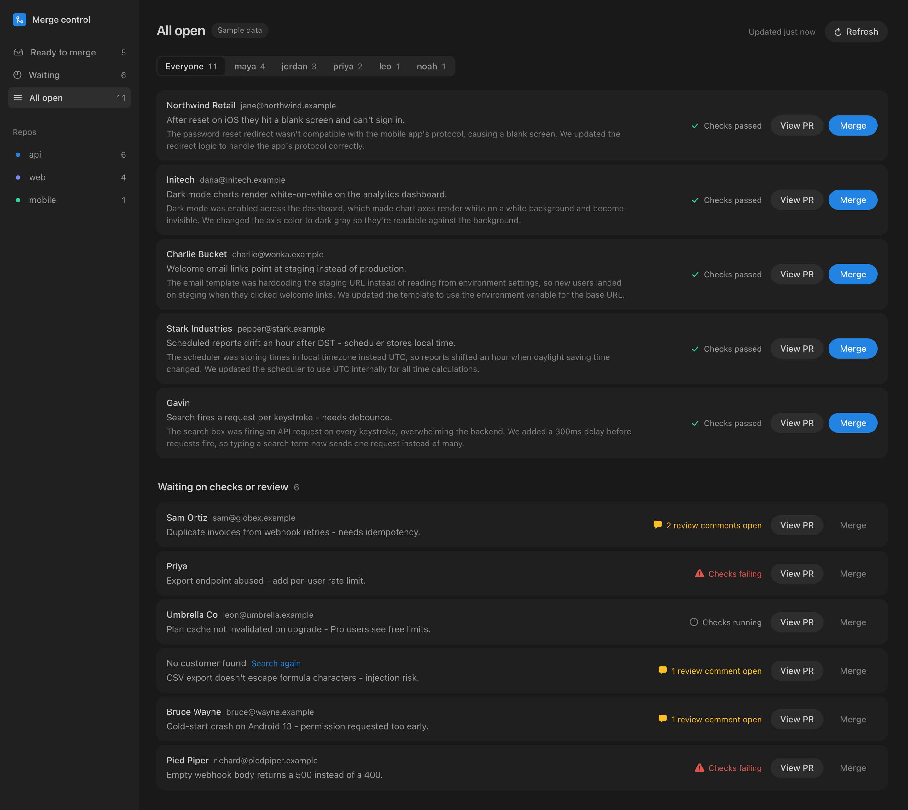
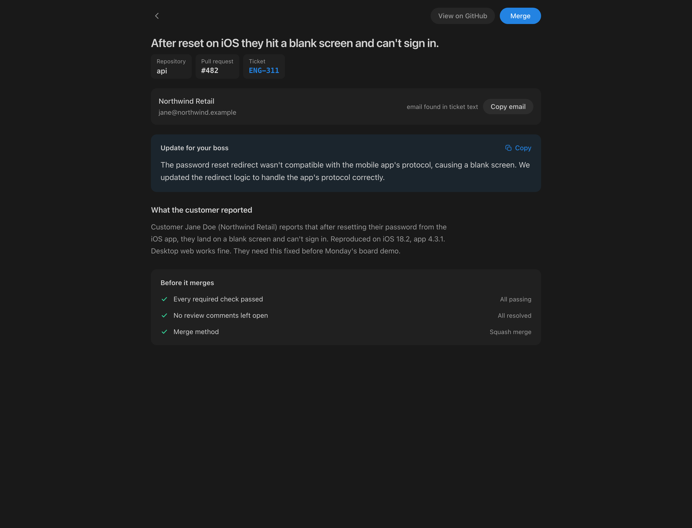
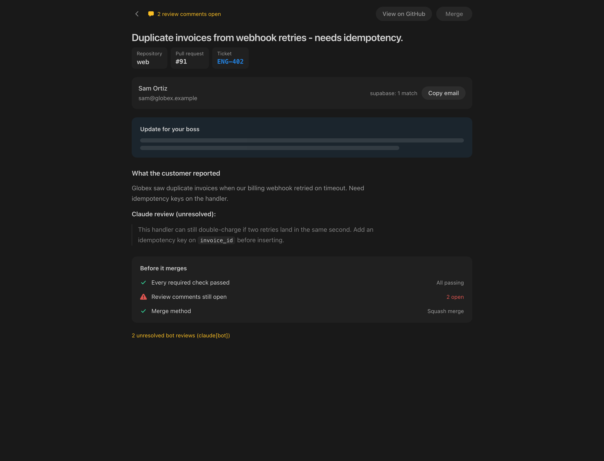

<div align="center">

# Merge Desk

### One screen to clear your merge queue — every open PR, the customer who reported it, and a one-click merge that only lights up when the gates are green.

[](https://nextjs.org/)
[](https://react.dev/)
[](https://www.typescriptlang.org/)
[](https://tailwindcss.com/)
[](https://supabase.com/)
[](#-quick-start)



</div>

> [!TIP]
> **Try it in 30 seconds, no credentials.** `npm install && npm run dev` boots
> in **mock mode** with an invented queue (fake customers, tickets, and a
> `claude[bot]` review). Merges never touch GitHub.

---

## Why it exists

GitHub shows pull requests. Linear shows tickets. The customer's email lives in
neither. Merge Desk joins all three onto one row, so the question *"what is
waiting on me, and is it safe to merge?"* has a single screen instead of four
tabs. Two actions per row — **Merge** and **View PR** — and nothing else.

## Features

| | |
|---|---|
| **Live queue** | Every open PR across your repos, newest first, capped at 50 and scoped to the last 7 days. Updates within a second of a change via Supabase Realtime; polls as a safety net. |
| **Customer on every row** | A resolution waterfall (Linear → ticket text → Supabase / PostHog → screenshot vision) turns each PR into a reachable contact — or a candidate list, or the ticket filer as fallback. |
| **Boss update** | A two-sentence, non-technical summary under 45 words, grounded in the ticket and PR, cached and copy-paste ready. |
| **Merge gates** | Merge only lights up when CI is green and no bot review thread is unresolved — re-checked server-side on every merge. |
| **One-click merge** | Squash-merge from the web or Slack. Merged rows animate off the board. |
| **Slack (optional)** | One card per newly mergeable PR, each with its own guarded Merge button. |

## Screenshots

<div align="center">

| Detail — customer, boss update, green gates | Blocked — a bot review holds the merge |
|:--:|:--:|
|  |  |

</div>

## 🚀 Quick start

```bash
npm install
cp .env.example .env.local     # optional — skip to run in mock mode
npm run dev                     # http://localhost:3939
```

With no `GITHUB_TOKEN` / `GITHUB_REPOS`, the app serves the fake queue in
`src/lib/mock.ts` so the whole UX is visible immediately. To point it at real
work, connect your tools below.

## Connect your data

Merge Desk is a shell that joins **your** tools together — it ships with no data
of its own. Everything except GitHub is optional, and the app degrades
gracefully when a source is missing (a PR with no ticket still lists and merges;
a PR with no resolved customer falls back to whoever filed it).

<table>
<tr><th align="left">Connection</th><th align="left">Powers</th><th align="left">Required?</th></tr>
<tr><td><b>GitHub</b></td><td>The queue, CI status, review threads, and the merge itself</td><td>✅ Yes</td></tr>
<tr><td><b>Linear</b></td><td>The ticket and the linked customer behind a PR</td><td>Optional</td></tr>
<tr><td><b>Supabase / PostHog</b></td><td>Resolving a name into a reachable email</td><td>Optional</td></tr>
<tr><td><b>Anthropic</b></td><td>Boss updates + reading contacts from screenshots</td><td>Optional</td></tr>
<tr><td><b>Supabase Realtime</b></td><td>Live push updates to the board</td><td>Optional</td></tr>
<tr><td><b>Slack</b></td><td>Merge cards in a channel or DM</td><td>Optional</td></tr>
</table>

<details>
<summary><b>Full setup — what each variable does</b></summary>

<br>

**1. GitHub — required.** Without it the app stays in mock mode.
- `GITHUB_TOKEN` — token with `repo` scope to read PRs, CI, review threads, and squash-merge. Falls back to `gh auth token` locally; must be set on a server.
- `GITHUB_REPOS` — comma-separated `owner/repo` allowlist. Also the merge allowlist: nothing outside it can be merged.
- `GITHUB_WEBHOOK_SECRET` — optional. Add a webhook to each repo at `/api/github/webhook` (pull request, check run, review thread) so the board updates instantly instead of on the poll.

**2. Linear — tickets & customers.** Skip it and rows show just the PR title.
- `LINEAR_API_KEY` — reads the issue referenced from the PR branch/title/body (default `SLA-####`, adjust in `src/lib/linear.ts`) plus any linked Linear customer.

**3. Customer lookup — Supabase & PostHog.** Turns a name into an email when Linear can't. Tailor the queries in `src/lib/supabase.ts` / `src/lib/posthog.ts` to your schema.
- `SUPABASE_URL`, `SUPABASE_SERVICE_KEY`, `SUPABASE_USERS_TABLE`, `SUPABASE_EMAIL_COLUMN` — your product's user database.
- `POSTHOG_HOST`, `POSTHOG_PERSONAL_API_KEY`, `POSTHOG_PROJECT_ID` — look up a person by name.
- Supabase also stores the shared **7-day queue + summary cache** and powers live updates. Run the migration in `supabase/migrations/` once.

**4. Boss updates — Anthropic.**
- `ANTHROPIC_API_KEY` — the two-sentence summary + screenshot contact extraction. Skip it and the update section stays empty.
- `ANTHROPIC_MODEL` — defaults to a Haiku model; override to trade cost/quality.

**5. Live updates — Supabase Realtime.**
- `NEXT_PUBLIC_SUPABASE_URL`, `NEXT_PUBLIC_SUPABASE_ANON_KEY` — let the browser subscribe to a broadcast channel. The anon key is safe to expose: the ping carries no PR data and RLS keeps that key out of every table. Blank → polling only.

**6. Access control — set before deploying.**
- `MQ_PASSWORD` — shared sign-in password. **A production build with no password refuses to serve**, because this surface lists customer emails and can merge `main`.
- `MQ_ACCESS_TOKENS` — optional machine tokens for scripts (`x-mq-token` header).
- `OWN_EMAIL_DOMAINS` / `OWN_COMPANY_NAMES` — your own domains/names, so teammates are never mistaken for the customer.

**7. Slack — optional.** See [`SLACK.md`](./SLACK.md); all `SLACK_*` vars stay empty until you turn it on.

</details>

<details>
<summary><b>How a row is built</b></summary>

<br>

1. **List open PRs** — one GitHub GraphQL query per repo, ordered by `UPDATED_AT`, with CI rollup and review threads nested in the same request.
2. **Find the ticket** — parse a Linear ref from branch, title, or body; fetch issue + linked customer in one GraphQL query.
3. **Resolve the customer** (never invents an address):
   - Linear customer `externalIds` / domains
   - email or name in the ticket body
   - PostHog by name, Supabase by domain / email
   - ticket screenshots (vision) only when the above fail — customer-side contacts only, teammates excluded
   - one confident hit → verified email; several → candidate list; none → ticket filer
4. **Gate the Merge button** — CI green, and no unresolved thread from a blocking bot.
5. **Merge** — squash (configurable), with gates re-checked immediately before the GitHub call.

First paint loads the newest 5 rows; the rest fill in behind a "Polling more"
indicator. A 45-second memory cache sits in front of a shared Supabase snapshot,
so cold serverless instances render without repeating GitHub, Linear, and
customer lookups. Webhooks patch that snapshot directly; a full reconciliation
every 15 minutes repairs missed deliveries. Rows and summaries expire after 7
days; closed or merged PRs are removed immediately.

</details>

<details>
<summary><b>Security & sign-in</b></summary>

<br>

- `MQ_PASSWORD` is a shared password; sign-in stores a signed, HttpOnly cookie for 14 days. Leaving it empty is fine locally, but a **production build with no password refuses to serve** — redirects to `/login`, APIs return 401, `/api/login` returns 503.
- Auth is verified at the edge (`src/proxy.ts`) and again in Node for API routes.
- Failed sign-ins lock after 5 attempts per IP for 15 minutes (process-local — add a Vercel Firewall rule in production).
- Merges are restricted to `GITHUB_REPOS` on both the web and Slack paths.
- `.env` / `.env.local` are gitignored. Mock data is invented on purpose so clones and screenshots never leak real customers.

</details>

## Deploy

Deploys to Vercel from `main` (pushes auto-deploy); env vars live in the Vercel
project, not in git.

```bash
vercel deploy --prod
```

## Stack

**Next.js 16** (App Router) · **React 19** · **Tailwind v4** · **Supabase
Postgres**. Integrations use plain `fetch` through server-only routes. Auth is an
HMAC-signed cookie verified at the edge and in Node.

## Product principles

1. Answer "can I merge this right now" before anything else.
2. Re-check gates server-side on every merge — never trust a stale button.
3. Customer identity is a first-class column, not buried in a drawer.
4. Anything you'll paste elsewhere (the update, the email) is one click away.
5. Missing data is stated plainly; never invented.
6. Generated text is forwarded as fact, so it may only assert what the material evidences.
